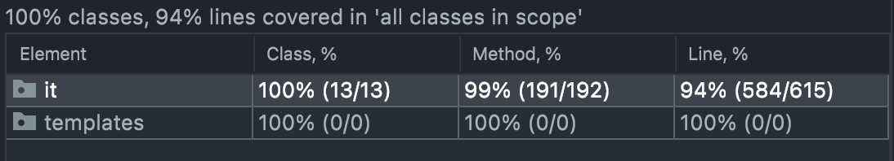
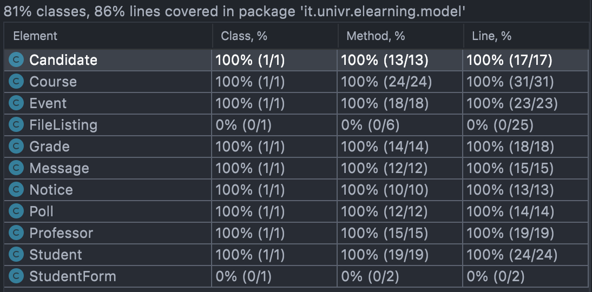

# Progetto Ingegneria del SW magistrale 21/22

Simone Baldi (VR457324) 
Andrea Caliari (VR456755)
Andrea Rossetti (VR457323)

###Indice
- [Sviluppo](#sviluppo)
- [Requisiti](#requisiti)
- [Scenari](#scenari)
- [Quality assurance](#quality-assurance)
    - [Unit testing](#unit-testing)
    - [Selenium testing](#selenium-testing)
    - [Coverage](#coverage)

##Sviluppo
Abbiamo deciso di adottare, durante lo sviluppo, uno stile di programmazione agile.
Abbiamo cercato di produrre un codice funzionante nei tempi stabiliti, riconsiderando gli obbiettivi preposti e decidendo di semplificare alcune funzionalità per evitare costi di sviluppo maggiori.

Dopo esserci confrontati e aver deciso una linea di sviluppo comune, ci siamo suddivisi il lavoro assegnando a ciascuno di noi tre Use Case da implementare, aggiornandoci frequentemente con videocall e lavorando insieme nelle parti di codice in comune.
Anche per i test, abbiamo deciso di suddividerceli sempre seguendo gli Use Case che ciascuno di noi ha implementato, in particolare ognuno ha testato con jUnit i modelli da lui utilizzati e i propri Use Case con Selenium

##Requisiti
E-Learning è un sistema informatico di sostengo per la didattica.

Il sistema è pensato per permettere agli insegnati di:
- gestire i corsi dove insegnano, aggiungendo materiale didattico
- inserire e modificare i voti degli studenti iscritti al corso
- aggiungere eventi relativi al corso
- assegnare compiti da fare a casa con la possibilità di consegnare direttamente sulla piattaforma l'elaborato dello studente
- creare un sondaggio relativo al corso
- inviare avvisi agli iscritti al corso

Lo stesso sistema permette invece allo studente di:
- visualizzare il proprio libretto potendo consultare i propri voti
- archiviare e consultare materiale personale
- scrivere e visualizzare annunci condivisi tra altri studenti
- partecipare alle elezioni studentesche con la possibilità di votare un candidato

Il sistema, utilizzando delle repository, memorizza tutti i dati inseriti e permette di cancellarli e modificarli.

Gli utenti che vengono gestiti dal sistema sono di tre tipologie:
- gli insegnati
- gli studenti
- l'admin delle elezioni, che può visualizzare le statistiche dei voti e aggiungere nuovi candidati

## Scenari
### Compilare un Form/Indagine/Poll (agente: professore)
#### Initial Assumption
Un docente ha la possibilità di creare sondaggi per valutare la bontà di un corso, dare un opinione sui servizi forniti dall’istituto, oppure, sulla qualità delle infrastrutture.
#### Normal
Il docente può decidere il titolo del sondaggio e la categoria o il corso nella quale inserirlo, dopo di che viene chiesto di inserire la domanda e il tipo di riposta che può essere una risposta multipla, singola o un semplice si/no. Inoltre, viene chiesto se il sondaggio dev’essere obbligatorio o meno per accedere a un corso o ad un esame.
#### What can go wrong
Il docente potrebbe dimenticare di compilare una risposta e lasciare vuoto il campo, viene visualizzato un pop up dicendo di eliminare la checkbox oppure di inserire una riga di testo.
Il docente potrebbe sbagliare la categoria o il corso, quindi, il docente ha la possibilità di modificare in qualunque momento il sondaggio.
#### Other Activities
Il docente ha la possibilità di vedere le statistiche dei vari sondaggi.
#### System state on completion
Il docente è loggato all’interno della piattaforma. Il sondaggio viene caricato e inserito all’interno della categoria/corso specificato all’inizio della creazione.
Una volta completato sarà visibile al docente stesso e agli studenti.

### Condivisione materiale didattico (agente: professore)
#### Initial Assumption
Il docente una volta fatto il login sulla piattaforma ha la possibilità di caricare materiale didattico e condividerlo con gli studenti.
#### Normal
Il docente accede al corso nel quale vuole condividere il materiale didattico, accede alla sezione di condivisione del materiale e seleziona il file da condividere.
#### What can go wrong
Il docente potrebbe caricare un file con un formato non accettato dal sistema, viene notificato tramite un pop up che il file non rispetta l’estensione corretta.
Il docente potrebbe inviare per sbaglio un file errato, ha la possibilità di rimuovere il file errato.
#### Other Activities
#### System state on completion
Il docente dopo aver loggato nel sistema può caricare i file, una volta completato l’upload gli studenti sono in grado di vedere il file (slides, homework, ecc..) nella pagina del corso e possono scaricarli.

### Archiviazione e consultazione materiale personale (agente: studente)
#### Initial Assumption
Agli studenti viene data la possibilità di archiviare materiale personale o compiti per casa su una piattaforma cloud.
#### Normal
Lo studente, una volta fatto il login sulla piattaforma, può accedere alla sezione dedicata al suo spazio personale di archiviazione cloud, oppure, accedere alla sezione di archiviazione dedicata al corso, nella quale può archiviare homework.
Nella sezione del Corso può essere inserita dal docente una data di scadenza entro la quale consegnare gli esercizi, dopo di che lo studente potrà visualizzare il commento del professore o l’eventuale voto inerente al compito per casa.
#### What can go wrong
Lo studente può inviare un file errato, oppure, accorgersi successivamente di aver inviato un file errato.
Viene data la possibilità selezionare il file errato e di eliminarlo per poi successivamente ricaricarlo.
#### Other Activities
#### System state on completion
Una volta fatto login nella piattaforma lo studente carica il proprio materiale oppure carica degli esercizi sulla pagina del corso che poi verranno valutati dal professore una volta scaduto il termine di consegna.

### Aggiunta dei voti degli studenti (agente: professore)
#### Initial Assumption
Il professore può inserire i voti degli studenti iscritti al suo corso in modo che possano vederlo registrato nel proprio libretto personale. 
Il professore deve essere loggato nel sistema tramite le proprie credenziali.
#### Normal
Il professore dopo aver valutato le prove degli studenti deve inserire i voti all’interno del sistema. L’utente accede alla propria pagina personale dove può vedere i corsi dove insegna. Sceglie il corso in questione e visualizza l’elenco degli studenti iscritti regolarmente al corso. 
Accede alla pagina d'inserimento dei voti dove è presente un elenco degli studenti con la possibilità di inserire i voti per ogni singolo studente e un commento. I voti sono numerici con la possibilità di indicare che uno studente era assente (A).
All’inizio della pagina sono presenti le caselle per inserire le informazioni sulla prova che è stata valutata (prova orale, scritta, laboratorio, ecc. e data). Dopo aver inserito tutti i voti, salva la modifica. Gli studenti ricevono una mail dove viene comunicato l’inserimento di un voto sul proprio libretto.
#### What can go wrong
Viene inserito un voto errato. Se il professore se ne dovesse accorgere o gli fosse fatto notare, può accedere alla pagina dell’elenco degli studenti e modificare il voto inserito. 
Uno o più studenti non erano iscritti al corso quando sono stati inseriti i voti anche se hanno partecipato alla prova. Dopo che gli studenti sono stati iscritti al corso, il professore accede nuovamente alla pagina di inserimento dei voti e inserisce le stesse informazioni già inserite la volta precedente (tipo di prova e data) e inserisce il voto solo degli studenti mancanti (ora visualizzati). 
#### Other Activities
Gli studenti possono visualizzare il voto sul proprio libretto.
#### System state on completion
Una volta salvata la modifica dei voti, il sistema visualizza un messaggio di successo e l’utente ritorna sulla pagina del corso.

### Aggiunta compiti per casa con scadenza per la consegna (agente: professore)
#### Initial Assumption
Il professore aggiunge la consegna per un compito da fare a casa con una scadenza entro la quale inviare il o i files con le risposte o l’elaborato da valutare/correggere. 
Il professore deve essere loggato nel sistema tramite le proprie credenziali
#### Normal
Il professore accede al sistema con le proprie credenziali. Accede alla propria pagina personale dove può vedere i corsi dove insegna. Sceglie il corso in questione e visualizza la pagina principale del corso. Sceglie di aggiungere un elemento alla pagina. 
Scegliere tra le opzioni di inserire una consegna per un compito a casa con scadenza. Nella pagina di inserimento viene richiesto il titolo del compito, la descrizione/consegna completa, eventuali allegati utili allo svolgimento del compito e la data entro la quale gli studenti devono consegnare lo svolgimento.
#### What can go wrong
Viene inserito un compito errato o viene fatto un errore nell’inserimento (errore di scrittura, file errato, data errata, ecc.). 
Il professore può, sulla pagina del corso, modificare la consegna o cancellarla completamente.
#### Other Activities
#### System state on completion
Una volta salvata la consegna, il sistema visualizza un messaggio di successo e l’utente ritorna sulla pagina del corso.

### Schedulare una video call con gli studenti iscritti al corso (agente: professore)
#### Initial Assumption
Il professore ha eseguito il login tramite le sue credenziali. Nel sistema è implementato un servizio di video conferenze. Il professore vuole inserire nel calendario di un corso un appuntamento per una video chiamata.
#### Normal	
Il professore accede al sistema con le proprie credenziali. Accede alla propria pagina personale dove può vedere i corsi dove insegna. Sceglie il corso in questione e visualizza la pagina principale del corso. Sceglie di aggiungere un elemento al corso. A questo punto sceglie il titolo della video chiamata, la data e l’ora. Il sistema registra l’evento nel calendario del corso e invia una mail informativa agli studenti con la data e il link per partecipare alla chiamata.
#### What can go wrong
Il professore sbaglia ad inserire alcuni dati (titolo o data) della chiamata. Accedendo al calendario può modificare o cancellare l’evento e il link di partecipazione viene disattivato.
#### Other Activities
Gli studenti possono accedere alla loro pagina e vedere l’evento nel calendario e il link di partecipazione (disattivato fino al momento scelto dal professore).
#### System state on completion
Una volta salvato l’evento, il sistema visualizza un messaggio di successo e l’utente ritorna sulla pagina del corso. Viene inviata una mail anche al professore con le stesse informazioni appena inserite e il link per avviare la chiamata.

### Inviare messaggi agli iscritti al corso (agente: professore)
#### Initial Assumption
Il professore ha la possibilità di inviare messaggi ad ogni partecipante (solo a tutti) del corso tramite la sezione apposita all’interno della sua aerea personale.
#### Normal
Il professore accede al corso nel quale vuole inviare il messaggio, entra nella sezione messaggi e può scegliere di inviarlo andando a compilare i campi che lo compongono come il titolo e il contenuto. Compilato tutto il professore provvederà ad inviarlo agli studenti.
Nel caso potessi servigli può accedere al corso nella sezione vecchi messaggi per cancellare o modificare il messaggio inviato.
#### What can go wrong
Il professore potrebbe omettere l'inserimento del titolo o del contenuto, di conseguenza il sistema non permetterà il salvataggio senza di essi.
#### Other Activities
Gli studenti ricevono il messaggio nella loro pagina relativa al corso.
#### System state on completion
Il professore può vedere il suo messaggio appena inviato entrando nel corso nella sezione vecchi messaggi.

### Bacheca annunci (agente: studente)
#### Initial Assumption
Lo studente può accedere alla bacheca annunci tramite la sezione apposita all’interno della sua area personale per vedere gli annunci disponibili o crearne uno.
#### Normal
Lo studente può accedere all’interfaccia della bacheca vedendo quali annunci sono presenti per il suo corso.
In caso lo studente volesse creare un annuncio può farlo accedendo alla bacheca e cliccando sul pulsante crea.
Inserirà poi il titolo e il contenuto del relativo annuncio.
Infine, per conferma la creazione gli basterà confermare la scelta.
#### What can go wrong
Lo studente che vuole creare un annuncio potrebbe omettere il titolo o il testo dell’annuncio di conseguenza il sistema non permetterà il salvataggio senza di essi.
#### Other Activities
#### System state on completion
Lo studente che crea un annuncio verrà reindirizzato alla bacheca dove sono presenti tutti gli annunci incluso il suo appena creato.

### Voto elezioni studentesche (agente: studente)
#### Initial Assumption	
Lo studente ha la possibilità di votare tramite un’interfaccia apposita all’interno della sua aera personale.
#### Normal
Lo studente può votare per le elezioni tramite l’interfaccia apposita andando a cliccare sulla sua preferenza tra i candidati presenti. Il voto è preso in considerazione solo se lo studente dopo aver selezionato la sua scelta conferma la votazione tramite il tasto di conferma.
#### What can go wrong
Lo studente seleziona uno tra i candidati disponibili; se lo studente andrà a confermare la votazione senza indicare una preferenza il sistema non gli permetterà di votare e potrà solo tornare indietro.
#### Other Activities
L’organizzatore delle elezioni potrà vedere le percentuali delle votazioni tramite la sua area personale.
#### System state on completion
Lo studente verrà reindirizzato alla pagina principale dei corsi dopo aver confermato la sua votazione.

## Quality assurance
Abbiamo scritto vari test per automatizzare la verifica del funzionamento delle diverse parti di codice e simulare gli Use Case che abbiamo precedentemente descritto.

Ci siamo affidati a due tipi di test:
- test eseguiti con jUnit: sono test sui model nel sistema; provano il corretto funzionamento dei metodi e costruttori di tutte le entity del programma
- test eseguiti con Selenium: sono test grafici che si occupano di verificare il corretto funzionamento del Controller e provano direttamente gli Use Case

### Unit testing
I jUnit tests sono stati usati per testare tutti i costruttori, i metodi setter e getter dei vari componenti del programma.

Sono stati inoltre utilizzati per testare il corretto funzionamento dei metodi utilizzati per collegare tra loro le entità del database, come ad esempio i metodi, all'interno della classe Course, usati per collegare gli altri componenti, come gli eventi, gli studenti, il professore responsabile, i messaggi e i sondaggi.

### Selenium testing
I test eseguiti con Selenium si sono concentrati sul simulare un utilizzo tipico del programma, in particolare sono stati provati gli Use Case.
I test sono stati eseguiti in ordine alfabetico per poter controllare, tramite i primi tre, il funzionamento minimo del programma.

Il primo test, aInit, viene utilizzato per chiamare un metodo di test contenuto nel controller, in modo da inizializzare le repository con valori di prova.

Il secondo e terzo test, aTestLoginProfessor e bTestLoginStudent, sono stati usati per verificare il corretto funzionamento del login per i due utenti principali a cui è indirizzato il sistema. Sono inoltre stati usati da tutti gli altri test per evitare la ripetizione di codice.

Gli altri 10 test fanno riferimento direttamente ai singoli Use Case (lo Use Case che prevede l'aggiunta di file da parte dello studente è stato diviso in due test per verificare separatamente l'inserimento di file personali e la consegna dei compiti per casa).

### Coverage
Abbiamo verificato la code coverage dei nostri tests utilizzando il tool integrato in IntelliJ. In generale, avviando sia i jUnit tests che i Selenium, abbiamo raggiunto una code coverage totale del 99% dei metodi e del 94% delle linee di codice:

In particolare, i test jUnit coprono l'81% delle classi e l'86% delle righe di codice, dal momento che le classi FileListing e StudentForm vengono coperte dai test Selenium perché non contengono costruttori e contengono metodi di appoggio per la gestione delle cartelle per i file inseriti durante l'utilizzo del programma e per la gestione dinamica dell'inserimento dei voti di un numero non specificato di studenti:

